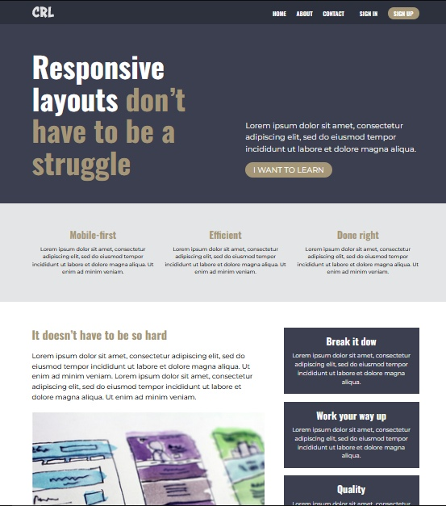

# Responsive layouts don’t have to be a struggle
Этот проект я сделал в конце 21-дневного бесплатного курса Кевина Повелла по адаптивному дизайну. Кевин очень крутой чувак, у него есть ютуб [канал](https://www.youtube.com/channel/UCJZv4d5rbIKd4QHMPkcABCw) и мне нравится его контент, очень советую. В данном проекте я использовал всю мощь CSS-переменных, поработал над адаптивом и даже добавил немного Javascript`а. В общем получилось круто). Я приложу демо ниже.

[Demo](https://beckyuldashev.github.io/responsive-layout)

[Beck](https://vk.com/beckyuldashev)

